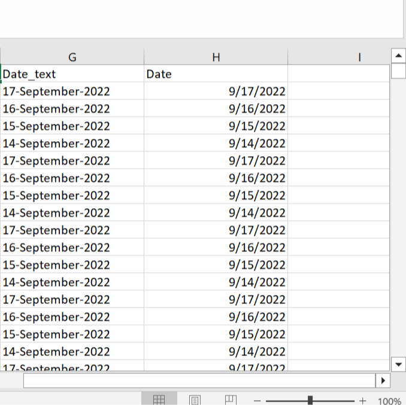

# Country-Delight-Data-Analysis-Documentation

## INTRODUCTION
 This document contains the step by step process of the data analysis conducted using Country Delight dataset with the aim of solving a business challenge. A little background information on the company, Country Delight is a company that started in India in 2015 with the goal of bringing back the basics to milk.The company specializes in delivering natural,fresh and unadulterated milk to the consumers doorstep. The company is posed with a challenge that this analysis aims to solve and I will be sharing my process with you. This analysis and Visualization was completed using Excel,I used Excel because its suitable for the data size.

## DATA DESCRIPTION
The raw dataset contains contains 6 columns and 1,449 rows, it contains country delight orders data from the 14th of September, 2022  to the 13th of March, 2023 the columns were named as follows:

1 Year of Created_date: This contains the year part of the order date.

2 Month of created_Month: This cointains the month part of the order date.

3 Week of created_date: This contains the week of the year the order falls.

4 Day of created_date: As the name implies its the day part of the order date.

5 Measure Names: This contains the names of 8 different values namely AOV( Average order value), ASP per unit(Average selling price), SKU per Order (stock keeping unit), Qty/order (Average quantity per order), customers(Number of customers per day), Order amount(total of orders per day), Quantity (total quantity ordered per day),Count of orders (total order per day).

6 Measure Values: This contains values that corresponds with the measure names.  

## BUSINESS QUESTION
Country delight is faced with this challenge overall orders per day in a region are increasing but the overall quantity ordered in the given region is not. So i will be conducting an exploratory data analysis to solve the problem and provide recommendations.

## DATA QUALITY ASSESSMENT 
Before conducting the EDA the first step was to assess the quality of the dataset to ensure that the dataset is valid, accurate and void of discrepancies. To do this I  started by  loading the dataset in Excel after which I did the following:

1 Check for Duplicate values using Excel built in feature: The dataset does not contain  duplicate values.

2 Check for missing Values by filtering the data set: The data set has no missing value

3 Check for Inconsistency: The data set is consistent, void of discrepancies and does not cointain outliers.

After this phase I proceeded to the next step  data transformation.

## DATA TRANSFORMATION
After assesing the data quality I transformed the data by creating a new column called date. I created this to combine the date values that was seperated  in 3 different columns into one datevalue containing the day, month and year. To do this  I used the CONCATENATE function in excel to combine the 3 columns using this formula.

```=CONCATENATE(D2,"-",B2,"-",A2)```

This formula combined the day which is contained in cell D2 with the month in cell B2 and the year contained in cell A2, then I used the autofill feature to fill other cells. Then I created another column to convert the combined date to an actual date value in Excel with the standard date format in Excel "mm/dd/yy". To do this I used the 'datevaule' function in Excel. 

```=DATEVALUE(G2)```

This coverted the G2 cell  which was created using the CONCATENATE function into date, the month written in words was converted into the equivalent numeric value.


## DATA ANALYSIS
To begin the data analysis I identified the column relevant to the business question which is the measure names, date, and measure values. I proceeded to create a pivot table with these aforementioned columns putting the date column was used as the the table row, while the measure names was used as the column and the measure value column was use as the value for the pivot table to aggregate the data set in other to identify the trends and pattern in the data.

### TACKLING THE BUSINESS QUESTION
To do this I will compare the total count of order versus the quantity ordered to see how these variable compare against each other. To do this I applied  filter to the column to view only the count of orders and the quantity columns, I grouped the data in the pivot table by year and months I also summarized these columns by average to get the average nurmber of orders in each month and the average quantity ordered per month. To better understand the result and easily identify trends I created a clustered bar chart to visualize the data. 

Insight: The chart shows that the Average quantity ordered per month is significantly higher than the average number of order per month for example the month of December recorded an average of 4235 order count  and 31,279 quantity ordered. so we see that quantity ordered isn't static or decreasing in comparision to the total number of orders.To see how the averages of these columns have changed over the months I plotted a line chart which is better for visualizing change over time. It does not show a consistent increase in order count values.

### TOTAL ORDER PER MONTH
 The total order per month was calculated using a pivot table just like the average order per month was calculated, just that in this case it was summarized using the sum function. I proceeded to plot a line graph with the result of the table  to see how total order and quantity ordered has changed over time and determine if the overall orders are increasing while the total quantity isn't. The sum of the values creates a better visualization and it's easier to spot trends.
 
 Insight: The total quantity ordered experienced a downward trend from November and peaked by February and continued a downtrend. Overall order per month also has the same trend pattern with the quantity ordered it also peaked at February before it experienced a downtrend in March. However, my hypothesis is that the reason for this is as follows, data from March is for only 13 days not the full month in comparsion to the succeeding months this could be the reason for the downward trend this is also applicable to September which covers data for 17 days, the available data doesn't cover the entire month. Having established this, to futher analyse the data I applied filter to the chart by removing September and March data to see the pattern of the months has its entire days in the dataset. From the chart we can see an evident upward trend from October to February in both variables. Order per day is increasing but the quantity ordered is also increasing.
 
 ### AVERAGE QUANTITY PER ORDER
 The challenge country delight is faced with states that count of orders are increasing but the quantity ordered isn't, generally when quantity ordered is static or decreasing while count of orders are increasing this implies that the quantity ordered by each customer has reduced, i.e more customers are purchasing the products but in lesser quantity. So to examine why that is happening I filtered the pivot table colunms to show only the average quantity per order to see if it has decreased over time resulting in lower or static overall quantity ordered per day. Moving on, I plotted a line graph with the result of the filtered table to examine how the average quantity ordered per day has changed over time.
 
 Insight: The chart shows that the average quantity ordered from September to November ranges from 6.3 to 6.5, it then increased to 7.5 in December and returned to 6.7 in January and then decreased to 6.3 and 5.9 in February and March respectively. The average quantity ordered did decrease from december to 6.9 In January however, this figure was still higher than the averages from the previous months. The increase recorded in December may be as a result of the festivities of the period which make customers buy more goods, The Retail Business Survey conducted by the Retailers Association of India (RAI), states that retail sales in December 2022 registered a 16% increase as compared to the sales recorded in December 2019 (the pre-pandemic period). So the 6.9 recorded in January can be considered high, and the 5.9 recorded in can not be considered low because the data does not cover the entire month.
 
 ### AVERAGE SELLING PRICE VS TOTAL QUANTITY ORDERED
 Just to reiterate the challenge this analysis aims to solve states that the business is experiencing an increase in the overall order per day while total quantity ordered isn't increasing. The result of this analysis so far has not revealed that rather both variables have the same trend pattern. I reckon that this is a more recent problem but the available data is not sufficent to analyze this problem so its important to conduct futher analysis to uncover the reason for this pattern. Different factors are responsible for a decrease in the quantity ordered by customers such as change in consumer behaivor,pricing strategies,increased competition, seasonal factors etc. Determining the specific factors responsible for an increase in the total number of orders per day without an increase in overall quantity would require a more detailed analysis of the business and the market in question. To examine the pricing strategies as a factor that influences decrease  in total quantity ordered here is my hypothesis.
 
 Hypothesis: There is a relationship between the average selling price and average quantity ordered.
 
 The data available provides the average selling per order, The law of demand states that a higher price leads to a lower quantity demanded and that a lower price leads to a higher quantity demanded. So I would do a statistical test to test the correlation between average selling price which is the independent variable and the quantity ordered the dependent variable. To do this I used the correlation function in excel which returns the correlation coefficient between two data sets. Correlation is a statistical technique of measuring the relationship between two variables to see if a relationship exist. The correlation coefficient will give you a numerical value for the strength and direction of the relationship, where a value of 1 indicates a perfect positive correlation, -1 indicates a perfect negative correlation, and 0 indicates no correlation.
 
 ```=CORREL(F3:F9,G3:G9)```
 
 The correlation coefficient between the average selling price and average quantity ordered is -0.362189179
 
 
 
A -0.362 indicates a weak negative correlation between the average selling price and the total quantity ordered. The negative sign indicates that the correlation is negative, which means that as the average selling price increases, the total quantity ordered tends to decrease. However, the value of -0.362189179 indicates that the relationship is weak, meaning that there is a lot of variability in the data and the correlation is not very strong.

In practical terms, this means that while there may be some effect of the average selling price on the total quantity ordered, other factors may also be influencing the quantity ordered. It's important to consider other variables that may be affecting the quantity ordered, such as marketing campaigns, customer behavior, and economic conditions, when interpreting the relationship between average selling price and total quantity ordered. 

### SCATTERPLOT AND REGRESSION
The next line of action is to plot a scatterplot with a trendline and get the R-squared value of the trendline using an in built feature in Excel.The scatter plot will show if there is a linear relationship between the average selling price and the average quantity ordered. The trendline will help visualize the direction and strength of the relationship, and the equation with the R-squared value will provide additional statistical information. 

After plotting the scatterplot I added a linear trendline and using the Excel feature to show the R squared value which is 0.1312. An R-squared value of 0.1312 indicates that approximately 13.12% of the variation in the average quantity ordered can be explained by the variation in the average selling price.

The R-squared value is a statistical measure that represents the proportion of the variation in the dependent variable (in this case, the total quantity ordered) that can be explained by the variation in the independent variable (in this case, the average selling price). An R-squared value of 1.0 indicates a perfect correlation between the variables, while a value of 0 indicates no correlation. Therefore, an R-squared value of 0.1312 suggests a weak correlation between the average selling price and the average quantity per order. The remaining 86.88% of the variation in the quantity ordered is likely due to other factors not included in the analysis. It's important to consider other variables that may be affecting the quantity ordered when interpreting the relationship between the average selling price and the total quantity ordered.

# CONCLUSION
After an analysis of the available data, its clear that the total quantity ordered and the total order per day has the same trend which contradicts the business challenge which indicates that the overall  orders per day is increasing while the overall ordered quantity is not. The data available is insufficient, further analysis with a relevant dataset need to be done to uncover the reason behind this situation.

Based on the analysis of the available data, it can be concluded that there is a weak negative correlation between the average selling price and the average quantity per order, as indicated by the correlation coefficient of -0.362 and R-squared value of 0.1312. However, it's important to note that the data available for analysis is insufficient, and there may be other factors that are affecting the quantity ordered, which were not accounted for in this analysis.

Therefore, further research or analysis needs to be done to gain a more complete understanding of the relationship between the average selling price and the average quantity ordered, including the exploration of additional variables that may be influencing the quantity ordered.

## REFERENCES
[IBEF(Indian brand equity foundation)] (https://www.ibef.org/news/december-retail-sales-jump-by-16-from-pre-covid-levels)
 
